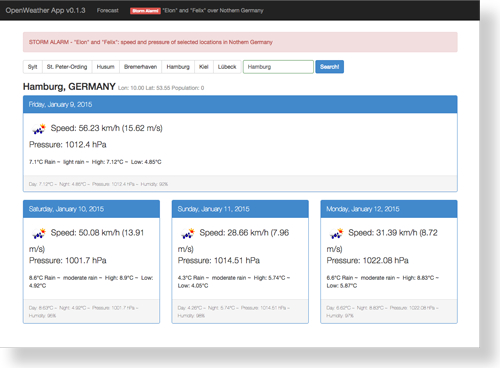

### Note: Tagging + minor update on 2015/09/01 

I renamed view partial file and variables for storm "Xaver" to more neutral "storm" and renamed "Storm Alarm!" link 
in header bar so they refer to storms "Elon" and "Felix" currently making some wind over Northern Germany. Furthermore
I introduced irregular tagging release states - see CHANGELOG for details.
 


# angular-openweather-app — a weather forecast app written in AngularJS



"OpenWeather App" is a small AngularJS project that makes use of the [OpenWeatherMap](http://openweathermap.org/)
service for fetching and displaying weather data and forecasts based on a given location (city).

_This project basically serves as an example app I refer to within an article about AngularJS
I wrote for the German web technology magazine [t3n no. 34](http://t3n.de/news/t3n-34-fertig-100-wichtigsten-netzkoepfe-508528/)._


## Demo

A demo site running this little app can be found [here](http://w4.matthiaslienau.de/angular-openweather-app/app/).


## Why?

Points of interests:

* Building an app with AngularJS (of course!)
* Building an app based on the [OpenWeatherMap API](http://openweathermap.org/API/)
* Bootstrapping an AngularJS app: Basic modules and view definition, ng-app, ng-view
* Defining a controller for handling the weather data in $scope
* Defining a service for fetching weather data from openweathermap.com via JSONP
* Defining a custom directive for instantly embedding sort of "weather data day panel"
* Setting up unit and e2e-tests with karma/jasmine

angular-openweather-app uses:

* [AngularJS v1.2.0-rc.2](https://github.com/angular/angular.js) / [angular-seed](https://github.com/angular/angular-seed)
* [iso-3166-country-codes-angular](https://github.com/BluePyth/iso-3166-country-codes-angular)
* [Bootstrap v3.0.0](https://github.com/twbs/bootstrap)


## Installation

### Clone repository and install dependencies

via git and npm:

```
$ git clone git@github.com:atufkas/angular-openweather-app.git [my-app-name]
$ cd [my-app-name]
$ npm install
```

### Run application via server

(see also [angular-seed docs](https://github.com/angular/angular-seed))

You can pick one of these options:

* serve this repository with a webserver of-your-choice
* install node.js and run `scripts/web-server.js`

Then navigate your browser to `http://localhost:<port>/app/index.html` to see the app running in
your browser.


## Contribute!

Ideas, suggestions and pull requests are welcome. Someone willing to suggest a fancy (responsive) design
for desktop and mobile use?


## Todo

* Make use (and parse) more provided weather data (+ add filters, formatting)
* Internationalization / Localization
* Provide "use current location" and fetch data via lat/lon
* Build a view with n-day-forecast in typical weather app style
* Improve UI/UX by integrating a fancy design, transitions, effects


## License

[The MIT License](http://opensource.org/licenses/MIT)

All data provided by the great service and API of [OpenWeatherMap](http://openweathermap.org/).

Copyright (c) 2013 Matthias Lienau &lt;matthias@mlienau.de&gt;
