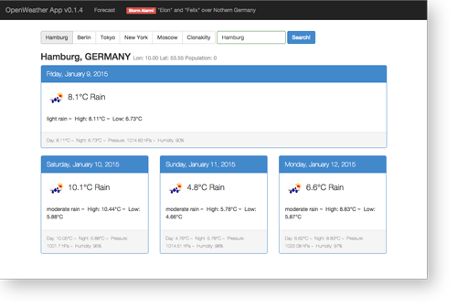

# angular-openweather-app — a weather forecast app written in AngularJS

---
Note: August 2024 housekeeping -> latest Release 0.3.3 

- pins node engine version to >= 20.0.0 and npm engine to >= 10.0.0
- changes various http urls to their https equivalents where applicable.
- applies fixes via `npm audit fix` 
---

[//]: # ([![Build Status]&#40;https://travis-ci.org/atufkas/angular-openweather-app.svg?branch=master&#41;]&#40;https://travis-ci.org/atufkas/angular-openweather-app&#41;)



"OpenWeather App" is a small AngularJS project that makes use of the [OpenWeatherMap](http://openweathermap.org/)
service for fetching and displaying weather data and forecasts based on a given location (city).

_This project basically serves as an example app I refer to within an article about AngularJS
I wrote for the German web technology magazine [t3n no. 34](http://t3n.de/news/t3n-34-fertig-100-wichtigsten-netzkoepfe-508528/)._


## Demo

A demo site running this little app can be found [here](http://w4.matthiaslienau.de/angular-openweather-app/app/).


## Why?

Points of interests:

* Building an app with AngularJS (of course!)
* Building an app based on the [OpenWeatherMap API](http://openweathermap.org/API/)
* Bootstrapping an AngularJS app: Basic modules and view definition, ng-app, ng-view
* Defining a controller for handling the weather data in $scope
* Defining a service for fetching weather data from openweathermap.com via JSONP
* Defining a custom directive for instantly embedding sort of "weather data day panel"
* Setting up unit and e2e-tests with karma/jasmine

angular-openweather-app uses:

* [AngularJS v1.2.32](https://github.com/angular/angular.js)
* [angular-seed](https://github.com/angular/angular-seed)
* [iso-3166-country-codes-angular](https://github.com/BluePyth/iso-3166-country-codes-angular)
* [Bootstrap v3.0.0](https://github.com/twbs/bootstrap)


## Installation

### Clone repository and install dependencies

via git and npm:

```
$ git clone git@github.com:atufkas/angular-openweather-app.git [my-app-name]
$ cd [my-app-name]
$ npm install
```

### Run application via server

(see also [angular-seed docs](https://github.com/angular/angular-seed))

You can pick one of these options:

1. serve this repository with a webserver of-your-choice
2. having installed node/npm (> 5.2.1), you can start a simple web server with `npx`:

```
$ npx serve app
```

Then open `http://localhost:3000/` in your browser.

### Run tests

To run unit and end-2-end tests with karma/jasmine, call these scripts:

```
$ ./scripts/test.sh
$ ./scripts/e2e-test.sh
```


## Contribute!

Ideas, suggestions and pull requests are welcome. Someone willing to suggest a fancy (responsive) design
for desktop and mobile use?


## Todo

* Make use (and parse) more provided weather data (+ add filters, formatting)
* Internationalization / Localization
* Provide "use current location" and fetch data via lat/lon
* Build a view with n-day-forecast in typical weather app style
* Improve UI/UX by integrating a fancy design, transitions, effects

## Star History

[](https://star-history.com/#atufkas/angular-openweather-app&Date)


## License

[The MIT License](http://opensource.org/licenses/MIT)

All data provided by the great service and API of [OpenWeatherMap](http://openweathermap.org/).

Copyright (c) 2013 Matthias Lienau &lt;matthias@mlienau.de&gt;
